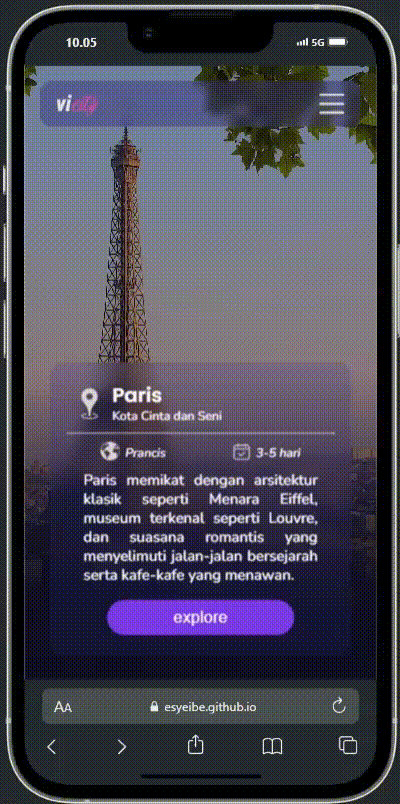
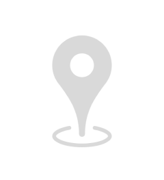

# VICITY
Submission untuk kelas [Belajar Dasar Pemrograman Web](https://www.dicoding.com/academies/123-belajar-dasar-pemrograman-web) di Dicoding

## Preview

  

## Kriteria Submission
- Terdapat elemen `<header>`, `<footer>`, `<main>`, `<article>`, dan `<aside>` di berkas HTML.
- Masing-masing elemen wajib berisi konten yang peruntukkannya sesuai dengan elemen tersebut (menerapkan konsep semantic HTML dalam menyusun struktur website).
Contohnya:
    - Tidak terdapat duplikasi elemen `<main>`.
    - Elemen `<main>` harus berada diantara `<header>` dan `<footer>`.
    - Harus terdapat elemen `<header>` sebelum `<main>` dan `<footer>` sesudah `<main>`.
    - Jika terdapat elemen `<header>` atau `<footer>` di dalam elemen `<article>` atau `<aside>`, maka hal tersebut diperbolehkan.
- Wajib menampilkan menampilkan foto di elemen `<aside>`. Anda boleh menampilkan foto diri Anda sekaligus menampilkan biodata lainnya atau Anda juga bisa menampilkan foto yang relevan dengan konten yang Anda tulis.
- Menyusun layout menggunakan flexbox, bukan float.
- Tema yang ditampilkan bebas, kecuali tema Bandung.
- Semakin detail dan lengkap website Anda maka nilai submission akan makin tinggi.

## Element
- ### icon yang di pakai

| Icon | Deskripsi                                    |
-------|----------------------------------------------|
|  | Menunjukkan nama kota.                          |
|   | Menunjukkan nama negara tempat kota berada.    |
|  | Menunjukkan durasu perjalanan wisata        |
|  | Icon dari situs web       |

- ### jenis font

| Nama Font        | Sumber                                               |
|------------------|------------------------------------------------------|
| **Nunito**    | [Google Fonts - Nunito](https://fonts.google.com/specimen/Nunito) |
| **Poppins**   | [Google Fonts - Poppins](https://fonts.google.com/specimen/Poppins) |

- ### warna yang di pakai

| Pratinjau Warna | Kode Hex   | Deskripsi               |
|-----------------|------------|-------------------------|
| 

 | `rgb(14, 12, 33)` | Warna gelap digunakan sebagai latar belakang utama situs. |
| 

 | `rgba(49, 46, 129, 0.4)` | Biru keunguan transparan digunakan pada header dan elemen navigasi. |
| 

 | `rgba(49, 46, 129)` | Biru keunguan solid, dipakai untuk latar belakang kotak dan detail elemen. |
| 

 | `#7c3aed` | Ungu cerah, digunakan untuk tombol eksplorasi di situs. |
| 

 | `#d5d5d5` | Abu-abu terang, dipakai pada tombol menu hamburger. |
| 

 | `#bc1888` | Merah muda, digunakan untuk tautan sosial media pertama. |
| 

 | `#0077B5` | Biru LinkedIn, digunakan untuk tautan sosial media kedua. |
| 

 | `rgb(108, 11, 244)` | Ungu gelap, dipakai pada tautan rute. |

